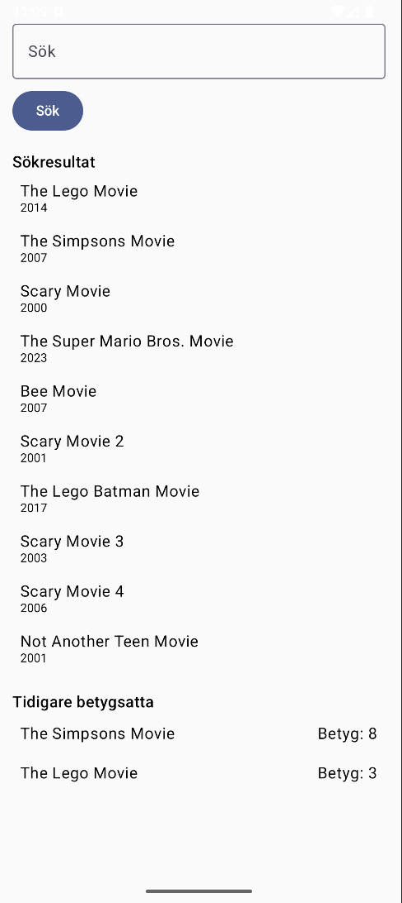
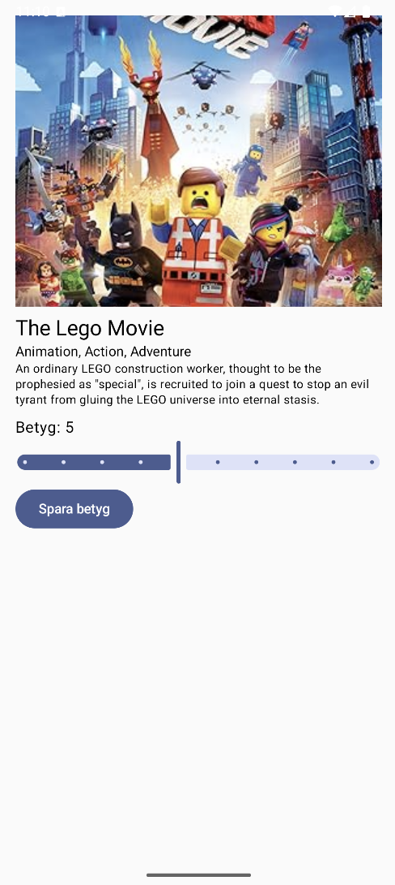

# 🎬 MovieRater – Android Arbetsprov för Digg

MovieRater är en enkel Android-applikation byggd med **Jetpack Compose** som låter användare söka efter filmer via OMDb API och betygsätta dem. Betygsatta filmer lagras lokalt med hjälp av Jetpack DataStore. Detta projekt speglar iOS-versionen byggd med SwiftUI.

## 🛠️ Byggd med

- **Kotlin**
- **Jetpack Compose** – UI-verktyg
- **Jetpack ViewModel & Lifecycle** – MVVM-arkitektur
- **Jetpack Navigation** – Navigering mellan vyer
- **DataStore** – Beständig lokal lagring för betyg
- **Coil** – Bildladdning
- **OMDb API** – Datakälla för filmer

## 📱 Funktioner

- 🔍 **Sök** efter filmer med titel
- ⭐ **Betygsätt** filmer från 1 till 5 stjärnor
- 📂 **Visa tidigare betygsatta** filmer
- 💾 Betyg lagras **lokalt** med Jetpack DataStore
- 🎨 Modern UI med **Jetpack Compose**

## 📦 Beroenden

| Bibliotek                         | Syfte                        |
|----------------------------------|------------------------------|
| `androidx.lifecycle`             | MVVM-arkitektur              |
| `androidx.navigation`            | Navigationskomponent         |
| `io.coil-kt:coil-compose`        | Ladda filmaffischer          |
| `com.google.code.gson:gson`      | Parsar JSON-svar             |
| `Jetpack Compose` (Material3, etc.) | Deklarativ UI               |
| `Jetpack DataStore`              | Lokal beständig lagring      |

## 🚀 Kom igång

1. Klona repot:
   ```bash
   git clone https://github.com/yourusername/movierater-android.git
   ```

2. Öppna i **Android Studio Hedgehog** eller nyare.

3. Kör appen på en enhet eller emulator.

## 🔐 OMDb API-nyckel

Appen kräver en OMDb API-nyckel. Skapa ett gratis konto på [http://www.omdbapi.com](http://www.omdbapi.com), och:

- Lägg till din API-nyckel i `MovieService.kt`:
  ```kotlin
  private val apiKey = "your_api_key_here"
  ```

## 🧪 Testning

Appen använder JUnit för enhetstester. Du kan köra tester från Android Studio via:

```
Run > Run 'All Tests'
```

## 📷 Skärmbilder

| Huvudvy | Detaljvy |
|--------|----------|
|  |  |

## 📂 Mappstruktur

```
├── MainActivity.kt
├── navigation/
├── screens/
├── viewmodel/
├── network/
├── storage/
└── model/
```

## 👩‍💻 Författare

Sebastian Strus

## 📄 Licens

MIT-licens. Se `LICENSE`-filen för detaljer.
